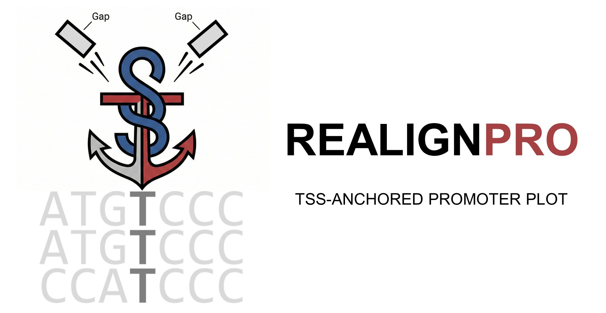

<p align="center">
  
</p>

# ReAlignPro

ReAlignPro is a command-line toolkit for:
- `fa2maf`: identify orthologous regions via LASTZ reciprocal-best hits, align sequences with MUSCLE, and export MAF/TSV outputs.
- `maf2bed`: extract target-shared, others-absent positions from a MAF/MAF.GZ and write BED3 intervals.
- `tsv2fig`: generate PDF sequence-table plots from a conservation-matrix TSV.

## Installation

### pip
```bash
pip install realignpro
```

Note: `fa2maf` requires external binaries available in `PATH`:
- `lastz`
- `muscle`
- `samtools`

### conda (recommended)
```bash
mamba install -c conda-forge -c bioconda realignpro lastz "muscle=3.8.1551" samtools
```

## Quick start

```bash
realignpro --help
realignpro fa2maf --help
realignpro maf2bed --help
realignpro tsv2fig --help
```

## License
GPL-3.0
